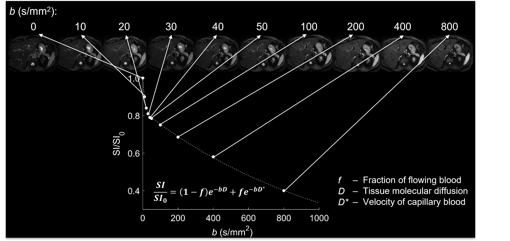

# liver-IVIMDWI

This repository contains the image analysis code for calculating apparent diffusion coefficients (ADC) and intravoxel incoherent motion (IVIM) diffusion-weighted imaging (DWI) parameters within manual segmentations on 3D abdominal MRI scans of the liver associated with the study by Volniansky A, Lefebvre TL et al. published in Magnetic Resonance Imaging (Volniansky A et al. Inter-visit and inter-reader reproducibility of multi-parametric diffusion-weighted MR imaging in longitudinally imaged patients with metabolic dysfunction-associated fatty liver disease and healthy volunteers. Magnetic Resonance Imaging. 2024).  

In-house code has been developed for IVIM DWI parameters calculation in MATLAB and `elastix` (Klein S et al. elastix: a toolbox for intensity based medical image registration. IEEE Transactions on Medical Imaging. 2010) was used for performing 3D image co-registration of DWI series, prior to voxel-wise IVIM model fitting.

